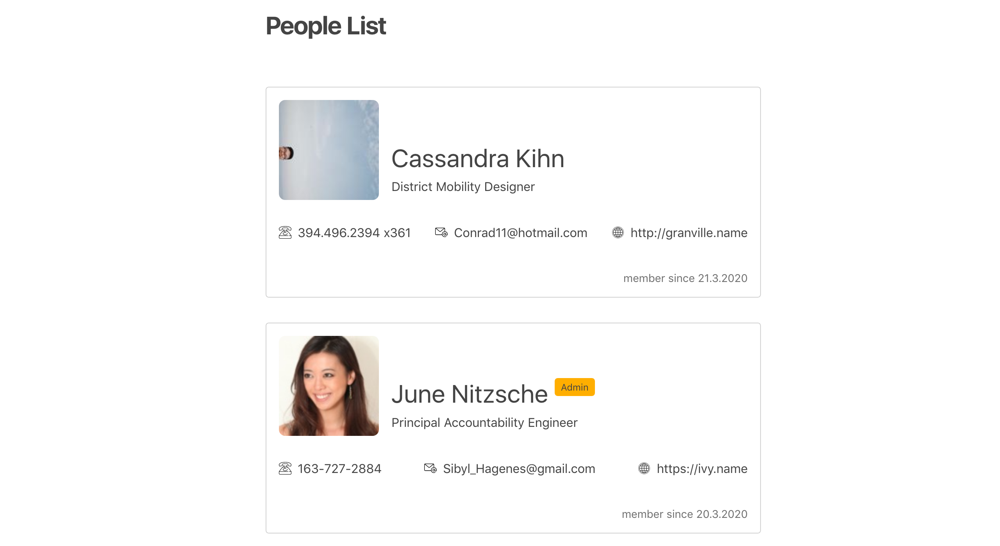

# List with JSX

Let's display a list of users with React, using JSX this time. 
The list could look something like this:

* use [create-react-app](https://create-react-app.dev/docs/getting-started) to boostrap a project
* use JSX to display the list
* use all the data provided, and all the properties
* use Sass (instead of CSS) to style the page - you can make use of partials, variables and other useful Sass features
* if the user is an admin, display a badge indicating their status (see 2nd card in screenshot)
* phone, email and website should have an icon, and should be links that open in a new tab, and should have a hover effect
* date of membership should be formatted as date in the German locale
* avatar should have an `alt` attribute that is the first and last name of the user